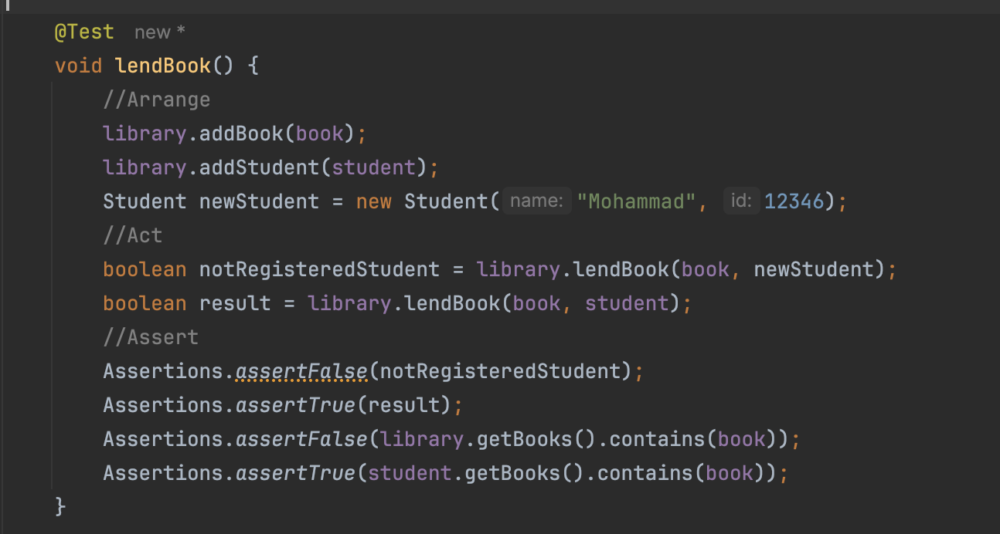
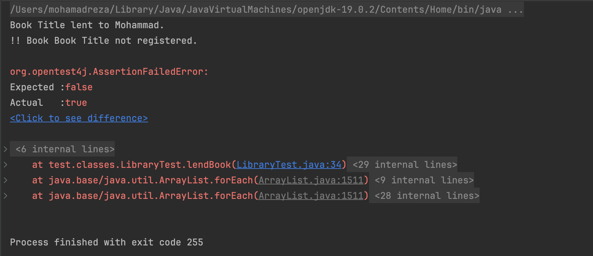
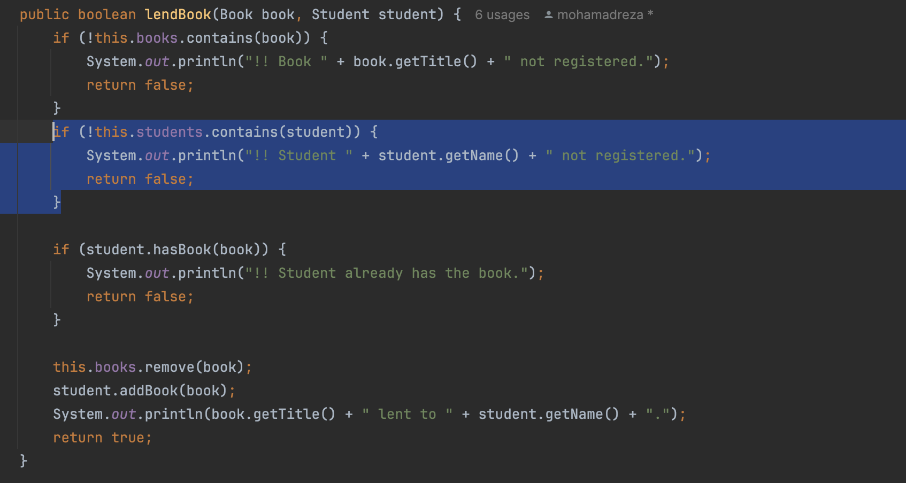
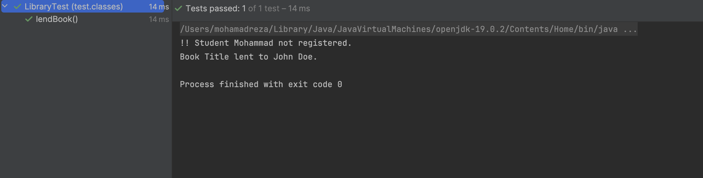

به نام خدا

# توسعه آزمون‌رانه و پوشش آزمون (Test-driven Development and Test Coverage)

## استفاده از TDD
1.  در قسمت اول از پیدا کردن عیوب موجود در کد اصلی تست ای برای تابع lendBook نوشتیم که این تست در مسیر `src/test/classes/LibraryTest/` قرار دارد. در زیر تصاویر مربوط به تست نوشته شده و کد اصلاح شده را برای پاس کردن این تست داریم.

1. در فایل
`Library.java`
دو تابع جستجو وجود دارد که باید با توجه به کامنت‌های آن‌ها و با استفاده از روش 
TDD
کاملشان کنید. برای این کار ابتدا تعدادی تست بنویسید که نیازمندی‌های این ۲ تابع را پوشش دهند، سپس ۲ تابع را به شکلی کامل کنید که همه آن‌ها پاس شوند.

گزارش مختصری از مراحل انجام آزمایش را در فایل README.md پروژه بنویسید.

## پرسش‌ها
پاسخ پرسش‌های زیر را داخل فایل README پروژه بنویسید:

۱. روش
TDD
را با روش تست کردن سنتی که در آن بعد از نوشتن برنامه، تست‌ها نوشته می‌شوند، از نظر نوع پروژه‌هایی که هر یک برای آن‌ها مناسب هست، مقایسه کنید.

۲. در فرایند ایجاد نرم‌افزار هم تیم ایجاد
(Development Team)
و هم تیم تضمین کیفیت
(QA Team)
وظیفه تست نرم‌افزار را برعهده دارند.
هر کدام از این تیم‌ها بیش‌تر با کدام دسته از انواع تست سروکار دارد؟ چرا؟ انواع تست ذکر شده را به طور مختصر شرح دهید.

۳. روالی ‬‫را که‬ ‫برای‬ ‫پروژه‬ ‫‪json-simle‬‬ ‫ارائه‬ ‫شد‬،‬ ‫برای‬ پروژه ای که بر روی آن مشغول هستید هم‬ ‫انجام‬ ‫دهید.
برای ‫به‬ ‫دست‬‫‌آوردن‬ ‫اعداد‬ ‫پوشش‬ ‫آزمون‬ ‫کافی‬ ‫است‬ ‫بر‬ ‫روی‬ ‫پکیج‬ ‫‪java‬‬ ‫در‬ ‫مسیر‬ ‫‪test‬‬ ‫کلیک‬ ‫راست‬ ‫کرده‬ ‫و‬ ‫گزینه ‬‫‪coverage‬‬ ‫‪with‬‬ ‫‪Tests‬‬ ‫‪All‬‬ ‫‪Run‬‬ ‫را‬ ‫انتخاب‬ ‫کنید‬ ‫(نیازی‬ ‫به‬ ‫اجرای‬ ‫عادی‬ ‫پروژه‬ ‫نیست)‪.‬‬‫

۴. با افزودن بخش‌هایی به کد تست، اعداد پوشش آزمون را در مورد تمامی کلاس‌های موجود در برنامه بهبود دهید. درصد افزایش اعداد پوشش آزمون مهم نیست ولی بخش‌هایی که به کد تست اضافه می‌شوند باید معنادار باشند و صرفاً یک فراخوانی ساده کلاس یا متد، بدون استفاده در بخش‌های دیگر کد کافی نیست. 

## نحوه ارسال پروژه:
آدرس مخزن پروژه خود را ارسال کنید. توجه کنید که مخزن شما و کانبان آن عمومی (public) باشد.

